<!--
  PROFILE README — repo must be named exactly: mohammed18salah
  GitHub shows this on your profile page automatically.
-->

<!-- ═══════════════════ PORTRAIT + INFO PANEL ═══════════════════ -->
<table>
<tr>
<td valign="top"></td>
<td valign="top"></td>
</tr>
</table>

## Mohammed Salahuldeen

**AI Systems Builder · Automation Architect · Founder-minded Technologist**

 

<!-- ═══════════════════ STREAK STATS ═══════════════════ -->

  

<!-- ═══════════════════ CONTRIBUTION HEATMAP (daily auto-update) ═══════════════════ -->

